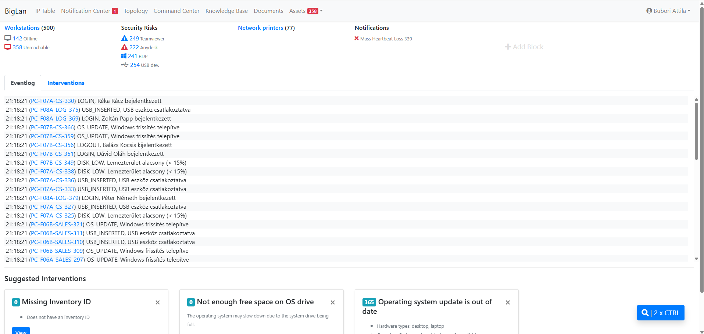
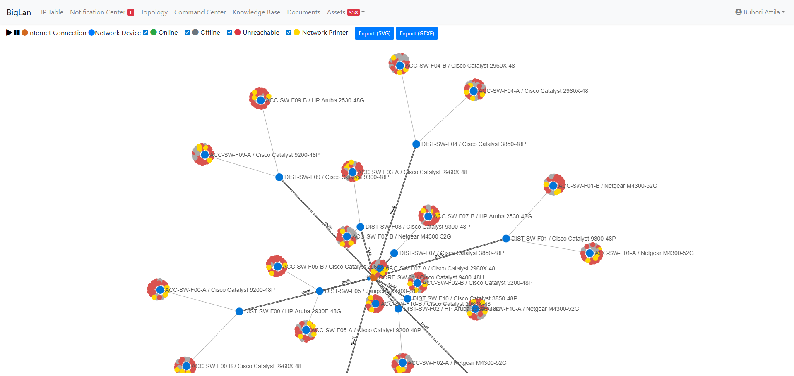
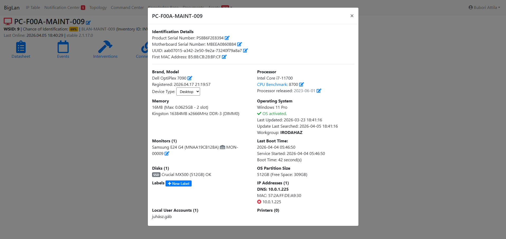
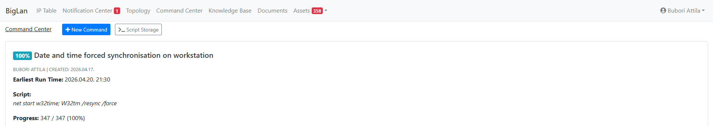
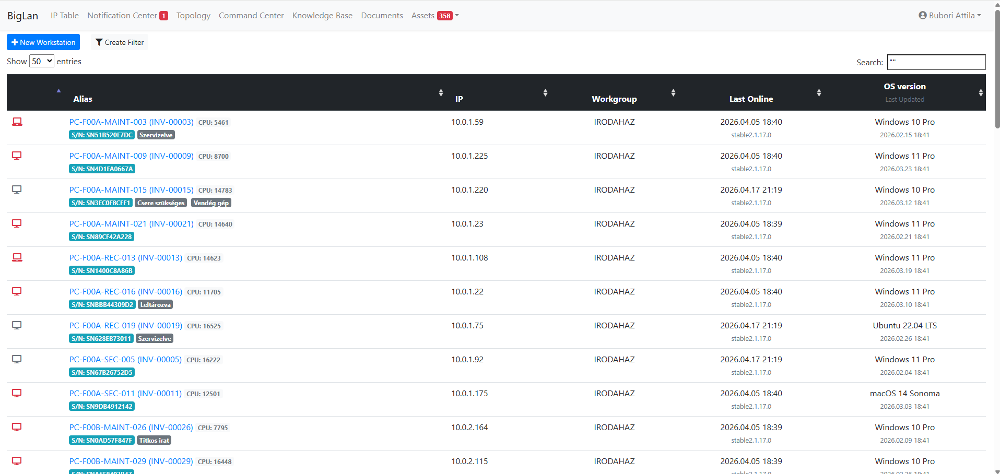
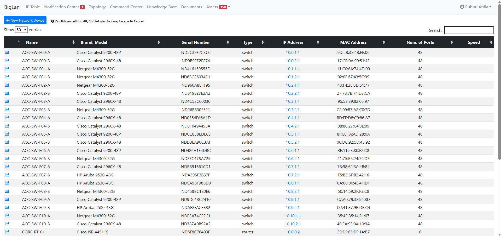
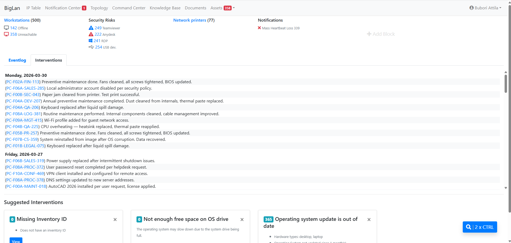
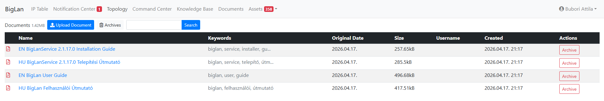

BigLan Network Monitoring System
================================
BigLan is a network monitoring system for medium to large internal networks. It helps system administrators and network engineers manage networks that are poorly documented — or not documented at all — by mapping the network, monitoring it, and keeping the device inventory up to date.

BigLan has two main parts: a server (Ubuntu 24.04, Apache, MySQL, Laravel) and client-side service applications. Clients send data to the server, which logs it and uses it to infer the state of endpoint devices and the network.


Screenshots
===========
<p float="left">
  
  
</p>
<p float="left">
  
  
</p>
<p float="left">
  
  
</p>
<p float="left">
  
  
</p>


Developer Documentation
========================
Looking to understand how BigLan actually works under the hood? See the [Wiki](https://github.com/atlantisguru/biglan-server/wiki).


Installation
============
BigLan Server can be installed automatically on a fresh Ubuntu Server 24.04 LTS with a single script:
```
curl -O https://raw.githubusercontent.com/atlantisguru/biglan-server/main/install-biglan.sh
chmod +x install-biglan.sh
sudo bash install-biglan.sh
```
For manual installation steps, or if you want to understand what the script automates, see the Installation Guide:
 - <a href="https://biglan.net/EN-biglan-installation-guide.pdf" target="_blank">Installation Guide (EN)</a>
 - <a href="https://biglan.net/HU-biglan-telepitesi-utmutato.pdf" target="_blank">Telepítési útmutató (HU)</a>
 - <a href="https://biglan.net/ES-guia-de-instalacion-biglan.pdf" target="_blank">Guía de instalación (ES)</a>
 

Usage
=====
- <a href="https://biglan.net/EN-biglan-user-guide.pdf" target="_blank">User Guide (EN)</a>
- <a href="https://biglan.net/HU-biglan-felhasznaloi-utmutato.pdf" target="_blank">Felhasználói útmutató (HU)</a>
- <a href="https://biglan.net/ES-guia-del-usuario.pdf" target="_blank">Guía del usuario (ES)</a>


Client-side Service Application
===============================
The client-side installer can be found in the storage/downloads folder.
- <a href="https://biglan.net/EN-biglanservice-2-1-17-0-installation-guide.pdf" target="_blank">Installation Guide (EN)</a>
- <a href="https://biglan.net/HU-biglanservice-2-1-17-0-telepitesi-utmutato.pdf" target="_blank">Telepítési útmutató (HU)</a>
- <a href="https://biglan.net/ES-guia-de-instalacion-de-biglanservice-2.1.17.0.pdf" target="_blank">Guía de instalación (ES)</a>                


Available languages
===================
- Hungarian (Magyar)
- English
- Spanish (Español)

 		
Licenses
========
BigLan Network Monitoring System
Copyright (C) 2025  Bubori Attila

This program is free software: you can redistribute it and/or modify
it under the terms of the GNU Affero General Public License as
published by the Free Software Foundation, either version 3 of the
License, or (at your option) any later version.

This program is distributed in the hope that it will be useful,
but WITHOUT ANY WARRANTY; without even the implied warranty of
MERCHANTABILITY or FITNESS FOR A PARTICULAR PURPOSE.  See the
GNU Affero General Public License for more details.

You should have received a copy of the GNU Affero General Public License
along with this program.  If not, see <https://www.gnu.org/licenses/>.
    
## Third-party Technologies
This software uses third-party libraries and frameworks, including:
- Laravel (MIT License) https://laravel.com/
- Bootstrap (MIT License) https://getbootstrap.com/
- jQuery (MIT License) https://jquery.com/
- FontAwesome (Icons: CC BY 4.0, Fonts: SIL OFL 1.1, Code: MIT License) https://fontawesome.com/
- DataTables (MIT License) https://datatables.net/
- Sigma.js (MIT License) https://sigmajs.org/
- CKEditor (MIT License) https://ckeditor.com/
These components are not governed by the AGPL v3 license but retain their original license terms provided by their respective owners.

Author
=======
Bubori Attila

Contact
=======
info@biglan.net
